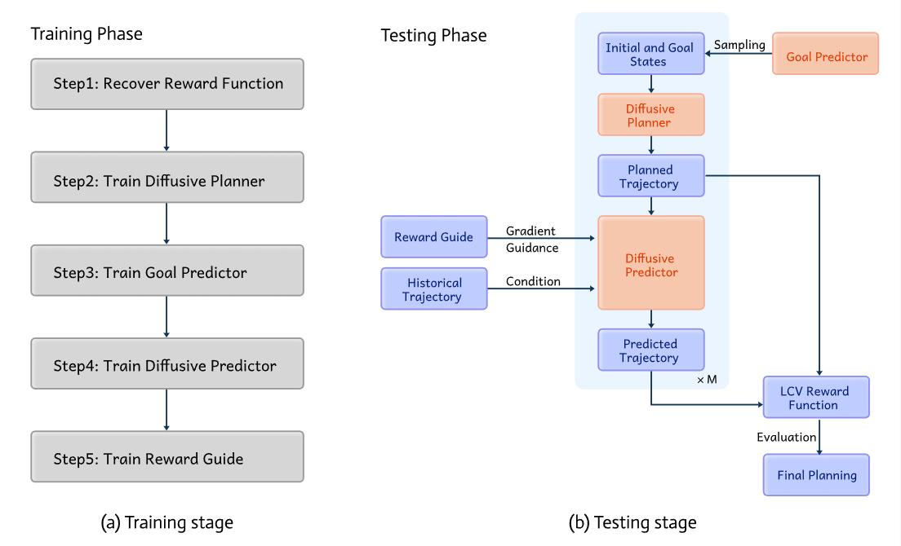
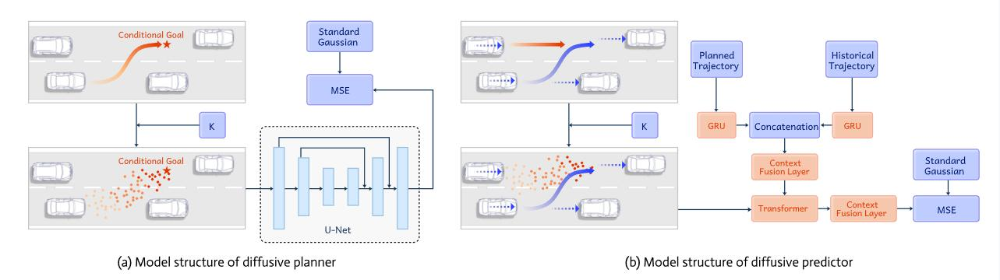
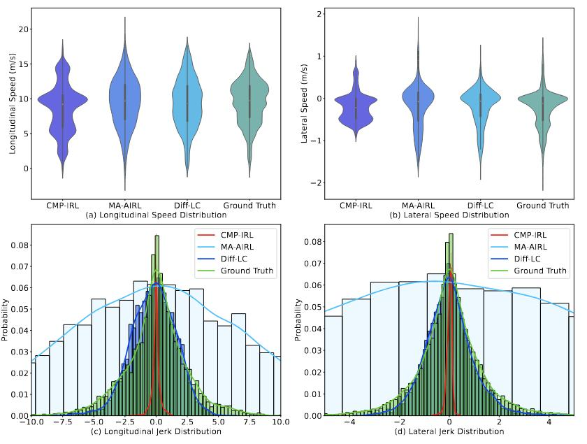
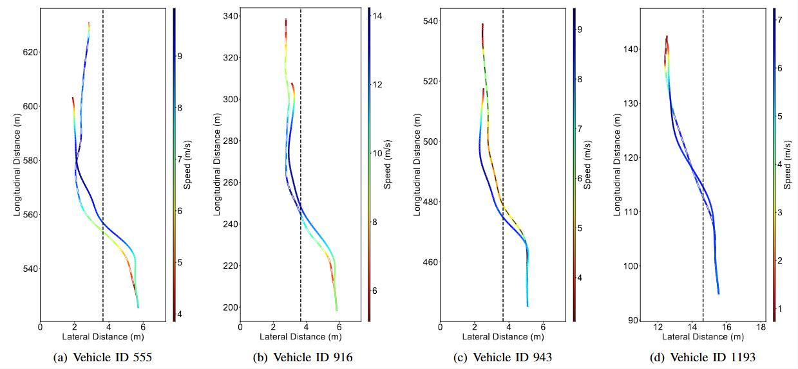

## Human-Like Interactive Lane-Change Modeling Based on Reward-Guided Diffusive Predictor and Planner

This repository includes codes of the paper named **Human-Like Interactive Lane-Change Modeling Based on Reward-Guided Diffusive Predictor and Planner**. In this study, we achieve human-like interactive lane-change modeling based on a novel framework named **Diff-LC**. The human-like modeling of LCV behaviors relies on an advanced diffusive planner, and the implemented trajectory is selected based on the recovered LCV reward function learned through Multi-Agent Adversarial Inverse Reinforcement Learning (MA-AIRL). To account for interactions between FVs and LCVs, we further employ a diffusive predictor to forecast future behaviors of FVs conditioned on both historical and planned trajectories. Additionally, we leverage the recovered reward function of FVs to enable controllable prediction of trajectories.

**This is the initial version of Diff-LC, modifications and simplifications will be made later.**


## Model Overview

**Diff-LC** includes training and testing stages. In the training stage, we separately train five models, then combine them at the testing stage.



The structures of the diffusive planner and predictor are shown below:



## Model Training

First separately train five models from Step 1 to Step 4, then evaluate the results based on Step 5.

- In Step 1, we recover the reward functions of the lane-changing vehicle (LCV) and the FV. Please run main.py for training.
- In Step 2, we train a diffusive planner based on Diffuser, and also train a goal predictor according to historical trajectories. Please run train.py and train_goal.py separately to obtain two models.
- In Step 3, we train a reward guide model based on the DDPM. Please run main.py for training.
- In Step 4, we train a diffusive predictor to predict future trajectories of FVs. Please run main.py for training.
- At last, put all trained models into *trained_model* folder and run 0_main.py for evaluation.


## Results

Comparison of ground-truth vs. predicted speed and jerk distributions. Diff-LC shows the most human-like distributions during lane-changing.




The generated and ground-true lane-changing trajectories. The trajectories represented with dashed lines indicate the ground truth paths, and the trajectories without dashed lines are planned paths by Diff-LC.




## Citation

```
@article{10819263,
  author={Chen, Kehua and Luo, Yuhao and Zhu, Meixin and Yang, Hai},
  journal={IEEE Transactions on Intelligent Transportation Systems}, 
  title={Human-Like Interactive Lane-Change Modeling Based on Reward-Guided Diffusive Predictor and Planner}, 
  year={2024},
  volume={},
  number={},
  pages={1-14},
  keywords={Trajectory;Vehicles;Planning;Autonomous vehicles;Predictive models;Cloning;Training;Reinforcement learning;Driver behavior;Decision making;Lane changing;human-like modeling;diffusion model;trajectory prediction},
  doi={10.1109/TITS.2024.3520613}}

```
